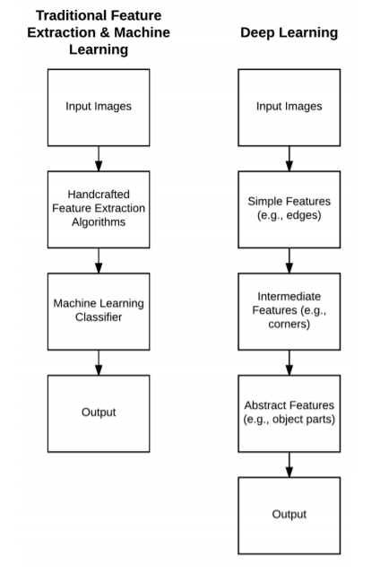

# 
 Welcome to Computer Vision

 **
Trần Việt Anh - Hoàng Nguyên Phương
** 

## 2. Deep Learning là gì

Học sâu là một lĩnh vực con của học máy. Mục tiêu trọng tâm của AI là cung cấp một tập hợp các thuật toán và kỹ thuật có thể được sử dụng để giải quyết các vấn đề mà con người thực hiện một cách trực quan và gần như tự động, nhưng lại rất khó khăn đối với máy tính.

Hình 2.1: Một biểu đồ Venn mô tả DeepLearning là 1 trường con của Machine Learning

### 2.1 Lịch sử

Lịch sử của mạng nơ-ron và học sâu là một lịch sử lâu dài, hơi khó hiểu. Có thể bạn sẽ ngạc nhiên khi biết rằng “học sâu” đã tồn tại từ những năm 1940 và trải qua nhiều lần thay đổi tên khác nhau, bao gồm điều khiển học, chủ nghĩa kết nối và Mạng thần kinh nhân tạo (ANN) quen thuộc nhất

Mặc dù được lấy cảm hứng từ bộ não con người và cách các tế bào thần kinh của nó tương tác với nhau. Chính điều này cho phép chúng ta vẽ ra những điểm tương đồng giữa một mô hình rất cơ bản của bộ não và cách chúng ta có thể bắt chước một số hành vi này thông qua các mạng thần kinh nhân tạo.

Mô hình mạng nơ-ron đầu tiên đến từ McCulloch và Pitts vào năm 1943 . Mạng này là một bộ phân loại nhị phân, có khả năng nhận ra hai danh mục khác nhau dựa trên một số đầu vào. Vấn đề là các trọng số được sử dụng để xác định label cho một đầu vào nhất định cần được con người điều chỉnh theo cách thủ công - loại mô hình này rõ ràng không mở rộng quy mô tốt nếu người vận hành bắt buộc phải can thiệp.

Với nhiều bài toán phức tạp hơn, chúng ta không thể xây dựng các mô hình mạng nơ-ron lớn và sâu vì số lượng tài nguyên và không phải cái gì con người có thể tác động. May mắn thay thuật toán lan truyền ngược (backpropagation algorithm) và các nghiên cứu của  Werbos (1974), Rumelhart (1986), và LeCun (1998) đã làm sống lại các mạng nơ-ron trước đó. Nghiên cứu của họ trong thuật toán lan truyền ngược cho phép các mạng nơ-ron truyền thẳng nhiều lớp được đào tạo (Figure 2.4).

Hình 2.2: Một mô hình nơ-ron có 3 layer chính: Layer đầu vào, Hidden Layer và Output Layer
   

Thuật toán lan truyền ngược là nền tảng của mạng nơ-ron hiện đại cho phép chúng tôi đào tạo hiệu quả các mạng nơ-ron và “dạy” chúng học hỏi từ những sai lầm của chúng. Nhưng ngay cả như vậy, tại thời điểm này, do (1) máy tính chậm (so với các máy hiện đại ngày nay) và (2) thiếu các tập huấn luyện lớn, được gắn nhãn, các nhà nghiên cứu không thể (đáng tin cậy) huấn luyện các mạng nơ-ron có nhiều hơn hai hidden layers - nó đơn giản là không khả thi về mặt tính toán. Ngày nay, hiện thân mới nhất của mạng nơ-ron mà chúng ta biết được gọi là học sâu. Điều làm cho deep learning khác biệt so với các phiên bản trước của nó là chúng ta có phần cứng chuyên dụng, nhanh hơn với nhiều dữ liệu đào tạo có sẵn hơn. Bây giờ chúng ta có thể đào tạo các mạng với nhiều hidden layers có khả năng học phân cấp, trong đó các khái niệm đơn giản được học ở các layer thấp hơn và các mẫu trừu tượng hơn ở các layer cao hơn của mạng.

### 2.2 Các loại học sâu

Các thuật toán học máy (nói chung) được chia thành ba nhóm - học có giám sát, không giám sát và bán giám sát. Chúng ta sẽ thảo luận về việc học có giám sát và không có giám sát trong chương này đồng thời lưu lại quá trình học bán giám sát để thảo luận trong tương lai.

Trong trường hợp được giám sát, một thuật toán học máy được cung cấp cả một tập hợp các đầu vào và đầu ra mục tiêu. Sau đó, thuật toán sẽ cố gắng tìm hiểu các mẫu có thể được sử dụng để tự động ánh xạ các điểm dữ liệu đầu vào đến đầu ra mục tiêu chính xác của chúng. Việc học có giám sát tương tự như việc giáo viên theo dõi bạn làm bài kiểm tra. Với kiến thức trước đây của bạn, bạn cố gắng hết sức để đánh dấu câu trả lời đúng trong bài kiểm tra của bạn; tuy nhiên, nếu bạn không chính xác, giáo viên của bạn sẽ hướng dẫn bạn cách đoán tốt hơn, có học hơn vào lần sau.

Trong trường hợp không được giám sát, các thuật toán học máy cố gắng tự động khám phá các tính năng phân biệt mà không có bất kỳ gợi ý nào về đầu vào là gì. Trong tình huống này, học sinh của chúng tôi cố gắng nhóm các câu hỏi và câu trả lời tương tự lại với nhau, mặc dù học sinh không biết câu trả lời chính xác là gì và giáo viên không ở đó để cung cấp cho họ câu trả lời đúng. Học không giám sát rõ ràng là một vấn đề khó khăn hơn học có giám sát - bằng cách biết câu trả lời (tức là kết quả đầu ra mục tiêu), chúng ta có thể dễ dàng xác định các mẫu phân biệt có thể ánh xạ dữ liệu đầu vào đến phân loại mục tiêu chính xác.

Trong bối cảnh học máy được áp dụng để phân loại hình ảnh, mục tiêu của thuật toán học máy là lấy các tập hợp hình ảnh này và xác định các mẫu có thể được sử dụng để phân biệt các lớp hình ảnh khác nhau.

Mỗi layer trong mạng sử dụng kết quả của các layer trước đó làm “khối xây dựng” để xây dựng các khái niệm ngày càng trừu tượng hơn. Các layer này được học tự động - không có kỹ thuật tính năng thủ công nào diễn ra trong mạng của chúng tôi. Hình 2.3 so sánh các thuật toán phân loại hình ảnh cổ điển sử dụng các tính năng được tạo thủ công với việc học biểu diễn thông qua học sâu và Mạng nơ-ron. Một trong những lợi ích chính của học sâu và phân loại cổ điển là nó cho phép chúng tôi bỏ qua bước trích xuất tính năng và thay vào đó tập trung vào quá trình đào tạo mạng của chúng tôi để học các bộ lọc này. Tuy nhiên, như chúng ta sẽ tìm hiểu ở phần sau của cuốn sách này, việc huấn luyện mạng để có được độ chính xác hợp lý trên một tập dữ liệu hình ảnh nhất định không phải lúc nào cũng là một nhiệm vụ dễ dàng.

  

Hình 2.3: Quy trình truyền thống là lấy một tập hợp hình ảnh đầu vào, áp dụng các thuật toán trích xuất tính năng được thiết kế thủ công, tiếp theo là đào tạo một bộ phân loại học máy về các tính năng. Bên phải: Phương pháp học sâu gồm các layer xếp chồng lên nhau để tự động học các tính năng phức tạp, trừu tượng và phân biệt hơn.
   

### 2.3 Tổng kết

Chương này giải quyết câu hỏi phức tạp “Học sâu là gì?”. Như chúng tôi đã phát hiện ra, học sâu đã xuất hiện từ những năm 1940, có nhiều tên gọi và hiện thân khác nhau dựa trên nhiều trường phái tư tưởng và xu hướng nghiên cứu phổ biến tại một thời điểm nhất định. Về cơ bản, học sâu thuộc họ Mạng thần kinh nhân tạo (ANN), một tập hợp các thuật toán học các mẫu lấy cảm hứng từ cấu trúc và chức năng của não. Không có sự đồng thuận giữa các chuyên gia về chính xác điều gì tạo nên một mạng nơ-ron "sâu"; tuy nhiên, chúng ta biết rằng: 
1. Các thuật toán học sâu học theo kiểu phân cấp và do đó xếp chồng nhiều layer lên nhau để học các khái niệm ngày càng trừu tượng hơn. 
2. Một mạng phải có > 2 lớp mới được coi là “sâu”. 
3. Một mạng có > 10 lớp được coi là "rất sâu."

**Nếu bạn cảm thấy hơi bối rối hoặc thậm chí bị choáng ngợp sau khi đọc chương này, đừng lo lắng - mục đích ở đây chỉ đơn giản là cung cấp một cái nhìn tổng quan cực kỳ cao về học sâu và chính xác nghĩa là “sâu”. Chương này cũng giới thiệu một số khái niệm và thuật ngữ mà bạn có thể không quen, bao gồm pixel, cạnh và góc - chương tiếp theo của chúng tôi sẽ đề cập đến các loại hình ảnh cơ bản này và cung cấp cho bạn một nền tảng cụ thể để đứng vững. Sau đó, chúng tôi sẽ bắt đầu chuyển sang các nguyên tắc cơ bản của mạng nơ-ron, cho phép chúng tôi chuyển sang học sâu và Mạng nơ-ron hợp pháp sau này trong cuốn sách này. Mặc dù chương này được thừa nhận là ở cấp độ cao, nhưng các chương còn lại của cuốn sách này sẽ rất thực tế, cho phép bạn thành thạo việc học sâu về các khái niệm thị giác máy tính.**

[Xem tiếp chương 3](Chuong3/chuong3.md)