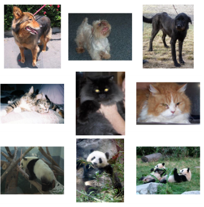

# 
 Welcome to Computer Vision

 **
Trần Việt Anh - Hoàng Nguyên Phương
** 

## 5. Bộ dữ liệu cho phân loại ảnh
Tại thời điểm này, tác giả đã quen với các nguyên tắc cơ bản của quy trình phân loại hình ảnh - nhưng trước khi chúng tôi đi sâu vào bất kỳ dòng code nào để xem thực sự cách lấy tập dữ liệu và xây dựng bộ phân loại hình ảnh, trước tiên hãy xem lại các tập dữ liệu mà bạn sẽ thấy bên trong Deep Learning cho Thị giác máy tính với Python

Một số bộ dữ liệu này về cơ bản đã được “giải quyết”, cho phép chúng tôi có được các bộ phân loại có độ chính xác cực cao (độ chính xác> 95%) mà không tốn nhiều công sức. Các bộ dữ liệu khác đại diện cho các hạng mục về thị giác máy tính và các vấn đề học sâu vẫn là những chủ đề nghiên cứu mở ngày nay và còn lâu mới giải quyết được.

### 5.1 Mnist

Hình 5.1: Bộ dữ liệu Mnist

MNIST (“NIST” là viết tắt của National Institute of Standards and Technology trong khi “M” là viết tắt của “modified” vì dữ liệu đã được xử lý trước để giảm bớt gánh nặng cho việc xử lý thị giác máy tính và chỉ tập trung vào nhiệm vụ nhận dạng chữ số) tập dữ liệu là một trong những bộ dữ liệu được nghiên cứu nhiều nhất về thị giác máy tính và tài liệu học máy.

Bản thân MNIST bao gồm 60.000 hình ảnh đào tạo và 10.000 hình ảnh thử nghiệm. Mỗi vectơ đặc trưng là 784-chiều, tương ứng với cường độ pixel 28 × 28 thang độ xám của hình ảnh. Các cường độ pixel thang độ xám này là các số nguyên không dấu, rơi vào phạm vi [0,255]. Tất cả các chữ số được đặt trên nền đen với nền trước là màu trắng và các sắc thái của màu xám. Với các cường độ pixel thô này, mục tiêu của chúng tôi là đào tạo mạng nơ-ron để phân loại chính xác các chữ số.

### 5.2 Động vật: chó,mèo,gấu panda

Hình 5.1: Bộ dữ liệu animal

Mục đích của tập dữ liệu này là phân loại chính xác hình ảnh có chứa chó, mèo hoặc gấu trúc. Chỉ chứa 3.000 hình ảnh, tập dữ liệu Động vật có nghĩa là một tập dữ liệu “giới thiệu” khác mà chúng tôi có thể nhanh chóng đào tạo mô hình học sâu trên CPU hoặc GPU của mình và có được độ chính xác hợp lý. Trong Chương 10, chúng tôi sẽ sử dụng tập dữ liệu này để chứng minh cách sử dụng các pixel của hình ảnh làm vectơ đặc trưng không chuyển sang mô hình học máy chất lượng cao trừ khi chúng tôi sử dụng Mạng nơ-ron hợp pháp (CNN).

### 5.3 Cifar10

Hình 5.1: Bộ dữ liệu cifar10

Cũng giống như MNIST, CIFAR-10 được coi là một tập dữ liệu điểm chuẩn khác cho phân loại hình ảnh  trong thị giác máy tính và tài liệu học máy. CIFAR-10 bao gồm 60.000 hình ảnh 32 × 32 × 3 (RGB)
Mặc dù là một tập dữ liệu nhỏ, CIFAR-10 vẫn thường xuyên được sử dụng để đánh giá các kiến ​​trúc CNN mới. Chúng tôi sẽ sử dụng CIFAR-10 dành cho người mới bắt đầu và người hành nghề.

### 5.4 Smiles

Hình 5.1: Bộ dữ liệu Smiles

Như tên cho thấy, tập dữ liệu SMILES bao gồm hình ảnh của các khuôn mặt đang cười hoặc không cười.Tổng số 25.000 hình ảnh được cung cấp để đào tạo thuật toán của bạn với các độ phân giải hình ảnh khác nhau. Một mẫu của tập dữ liệu có thể được nhìn thấy trong Hình 5.5. Cách bạn quyết định xử lý trước hình ảnh của mình có thể dẫn đến các mức hiệu suất khác nhau, một lần nữa chứng minh rằng nền tảng về thị giác máy tính và kiến thức cơ bản về xử lý hình ảnh sẽ đi được một chặng đường dài khi nghiên cứu sâu.

**Ngoài ra bạn có thể tham khảo thêm các bộ dữ liệu hoa, xe, và nhiều bộ dữ liệu khác của tác giả, thậm chí trên mạng. Chúng tôi kể tên tiêu biểu của các bộ dữ liệu**

[Xem tiếp chương 6](Chuong6/chuong6.md)