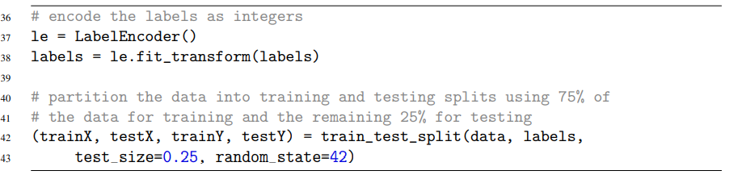

# Chương 7 model phân loại hình ảnh đầu tiên
Trong vài chương vừa qua, chúng tôi đã dành một khoảng thời gian hợp lý để thảo luận về các nguyên tắc cơ bản về hình ảnh, các loại hình học và thậm chí là quy trình bốn bước mà chúng tôi có thể tuân theo khi xây dựng bộ phân loại hình ảnh của riêng mình. Nhưng chúng tôi vẫn chưa xây dựng một bộ phân loại hình ảnh thực tế của riêng mình.

Điều đó sẽ thay đổi trong chương này. Chúng tôi sẽ bắt đầu bằng cách xây dựng một vài tiện ích trợ giúp để tạo điều kiện thuận lợi cho việc xử lý trước và tải hình ảnh từ đĩa. Từ đó, chúng ta sẽ thảo luận về bộ phân loại k-Nearest Neighbors (k-NN), lần đầu tiên bạn tiếp xúc với việc sử dụng máy học để phân loại hình ảnh. Trên thực tế, thuật toán này đơn giản đến mức nó không thực hiện bất kỳ hoạt động “học hỏi” thực tế nào - nhưng nó vẫn là một thuật toán quan trọng cần xem xét để chúng tôi có thể đánh giá cao cách mạng thần kinh học hỏi từ dữ liệu trong các chương sau.

Cuối cùng, chúng tôi sẽ áp dụng thuật toán k-NN của mình để nhận ra nhiều loài động vật khác nhau trong hình ảnh

## 7.1 làm việc với bộ dataset
Khi làm việc với tập dữ liệu hình ảnh, trước tiên chúng ta phải xem xét tổng kích thước của tập dữ liệu theo byte. Tập dữ liệu của chúng ta có đủ lớn để vừa với RAM có sẵn trên máy của chúng ta không? Chúng ta có thể tải tập dữ liệu như thể tải một ma trận hoặc mảng lớn không? Hay tập dữ liệu lớn đến mức vượt quá bộ nhớ máy của chúng tôi, yêu cầu chúng tôi “chia nhỏ” tập dữ liệu thành các phân đoạn và chỉ tải các phần tại một thời điểm?

Các bộ dữ liệu bên trong Starter Bundle đều đủ nhỏ để chúng ta có thể tải chúng vào bộ nhớ chính mà không cần phải lo lắng về việc quản lý bộ nhớ; tuy nhiên, bộ dữ liệu lớn hơn nhiều bên trong Gói thực hành và Gói ImageNet sẽ yêu cầu chúng tôi phát triển một số phương pháp thông minh để xử lý hiệu quả việc tải hình ảnh theo cách mà chúng tôi có thể đào tạo bộ phân loại hình ảnh (mà không hết bộ nhớ).

Điều đó nói rằng, bạn phải luôn nhận thức được kích thước tập dữ liệu của mình trước khi bắt đầu làm việc với các thuật toán phân loại hình ảnh. Như chúng ta sẽ thấy trong suốt phần còn lại của chương này, dành thời gian để tổ chức, xử lý trước và tải tập dữ liệu của bạn là một khía cạnh quan trọng của việc xây dựng bộ phân loại hình ảnh.

## 7.1.1 Giới thiệu tập dữ liệu "Động vật"

Figure 7.1: Ví dụ về bộ dữ liệu "Động vật" 

Hình ảnh bên trong tập dữ liệu Động vật thuộc ba lớp riêng biệt: chó, mèo và gấu trúc, với 1.000 hình ảnh ví dụ cho mỗi lớp. Hình ảnh chó và mèo được lấy mẫu từ thử thách Kaggle Dogs vs. Cats (http://pyimg.co/ogx37) trong khi hình ảnh gấu trúc được lấy mẫu từ tập dữ liệu ImageNet [42].

Chỉ chứa 3.000 hình ảnh, tập dữ liệu Động vật có thể dễ dàng phù hợp với bộ nhớ chính của máy của chúng tôi, điều này sẽ giúp đào tạo các mô hình của chúng tôi nhanh hơn nhiều mà không yêu cầu chúng tôi viết bất kỳ “mã chi phí nào” để quản lý một tập dữ liệu không thể phù hợp với bộ nhớ. Hơn hết, một mô hình học sâu có thể nhanh chóng được đào tạo trên tập dữ liệu này trên CPU hoặc GPU. Bất kể thiết lập phần cứng của bạn là gì, bạn có thể sử dụng tập dữ liệu này để tìm hiểu kiến ​​thức cơ bản về học máy và học sâu.

Mục tiêu của chúng tôi trong chương này là tận dụng trình phân loại k-NN để cố gắng nhận ra từng loài này trong một hình ảnh chỉ bằng cách sử dụng cường độ pixel thô (tức là không diễn ra quá trình trích xuất đối tượng địa lý). Như chúng ta sẽ thấy, cường độ pixel thô không phù hợp với thuật toán k-NN. Tuy nhiên, đây là một thử nghiệm điểm chuẩn quan trọng cần chạy để chúng ta có thể đánh giá cao lý do tại sao Mạng thần kinh chuyển đổi có thể đạt được độ chính xác cao như vậy trên cường độ pixel thô trong khi các thuật toán học máy truyền thống không làm được như vậy.

## 7.1.2 Khởi đầu cho Bộ công cụ học sâu 
Như tôi đã đề cập trong Phần 1.5, chúng tôi sẽ xây dựng bộ công cụ học sâu tùy chỉnh của riêng mình trong toàn bộ cuốn sách này. Chúng tôi sẽ bắt đầu với các chức năng và lớp trợ giúp cơ bản để xử lý trước hình ảnh và tải các tập dữ liệu nhỏ, cuối cùng xây dựng để triển khai các Mạng thần kinh kết hợp tân tiến hiện tại.

Trên thực tế, đây là bộ công cụ chính xác mà tôi sử dụng khi thực hiện các thí nghiệm học sâu của riêng mình. Bộ công cụ này sẽ được xây dựng từng phần, từng chương, cho phép bạn xem các thành phần riêng lẻ tạo nên gói, cuối cùng trở thành một thư viện chính thức có thể được sử dụng để nhanh chóng xây dựng và đào tạo các mạng học sâu tùy chỉnh của riêng bạn.

Hãy tiếp tục và bắt đầu xác định cấu trúc dự án của bộ công cụ của chúng tôi:

Mô-đun con của bộ dữ liệu sẽ bắt đầu việc triển khai một lớp có tên SimpleDatasetLoader của chúng ta. Chúng tôi sẽ sử dụng lớp này để tải các tập dữ liệu hình ảnh nhỏ từ đĩa (có thể vừa với bộ nhớ chính), xử lý trước từng hình ảnh trong tập dữ liệu theo một nhóm chức năng, sau đó trả về:

1. Hình ảnh ( i.e. ,Cường độ pixel thô)
2. Nhãn lớp được liên kết với mỗi hình ảnh

Sau đó, chúng tôi có mô-đun con cho việc tiền xử lý. Như chúng ta sẽ thấy trong các chương sau, có một số phương pháp xử lý trước mà chúng tôi có thể áp dụng cho tập dữ liệu hình ảnh của mình để tăng độ chính xác của phân loại, bao gồm trừ trung bình, lấy mẫu các bản vá ngẫu nhiên hoặc chỉ đơn giản là thay đổi kích thước hình ảnh thành kích thước cố định. Trong trường hợp này, lớp SimplePreprocessor của chúng tôi sẽ thực hiện phần sau - tải hình ảnh từ đĩa và thay đổi kích thước nó thành kích thước cố định, bỏ qua tỷ lệ khung hình. Trong hai phần tiếp theo, chúng tôi sẽ triển khai SimplePreprocessor và SimpleDatasetLoader bằng tay.

**Trong khi chúng tôi sẽ xem xét toàn bộ mô-đun pyimagesearch để học sâu, chúng tôi đã cố ý để lại giải thích về các tệp __init__.py như một bài tập cho người đọc. Các tệp này chỉ chứa các phép nhập lối tắt và không liên quan đến việc hiểu các kỹ thuật học sâu và máy học được áp dụng để phân loại hình ảnh. Nếu bạn chưa quen với ngôn ngữ lập trình Python, tôi khuyên bạn nên tìm hiểu những điều cơ bản [63] (http://pyimg.co/7w238).**

## 7.1.3 Một số bộ tiền xử lý hình ảnh cơ bản

Các thuật toán học máy như k-NN, SVM và thậm chí cả Mạng nơ-ron chuyển đổi yêu cầu tất cả các hình ảnh trong tập dữ liệu phải có kích thước vectơ đặc trưng cố định. Đối với hình ảnh, yêu cầu này ngụ ý rằng hình ảnh của chúng tôi phải được xử lý trước và chia tỷ lệ để có chiều rộng và chiều cao giống hệt nhau.

Có một số cách để thực hiện việc thay đổi kích thước và tỷ lệ này, từ các phương pháp nâng cao hơn tôn trọng tỷ lệ khung hình của hình ảnh gốc so với hình ảnh được chia tỷ lệ đến các phương pháp đơn giản bỏ qua tỷ lệ khung hình và chỉ giảm chiều rộng và chiều cao theo kích thước yêu cầu . Chính xác phương pháp nào bạn nên sử dụng thực sự phụ thuộc vào mức độ phức tạp của các yếu tố thay đổi của bạn (Phần 4.1.3) - trong một số trường hợp, việc bỏ qua tỷ lệ khung hình hoạt động tốt; trong các trường hợp khác, bạn sẽ muốn giữ nguyên tỷ lệ khung hình.

Trong chương này, chúng ta sẽ bắt đầu với giải pháp cơ bản: xây dựng bộ tiền xử lý hình ảnh có thể thay đổi kích thước hình ảnh, bỏ qua tỷ lệ khung hình. Mở simplepreprocessor.py và sau đó chèn mã sau:

**Dòng 2** nhập thư viện yêu cầu duy nhất của chúng tôi, các ràng buộc OpenCV của chúng tôi. Sau đó, chúng tôi xác định hàm tạo cho lớp SimpleProcessor trên **Dòng 5**. Hàm khởi tạo yêu cầu hai đối số, theo sau là một tùy chọn thứ ba, mỗi đối số được nêu chi tiết dưới đây:
* width: Chiều rộng mục tiêu của hình ảnh đầu vào của chúng tôi sau khi thay đổi kích thước.
* height: Chiều cao mục tiêu của hình ảnh đầu vào của chúng tôi sau khi thay đổi kích thước.
* inter: Một tham số tùy chọn được sử dụng để kiểm soát thuật toán nội suy nào được sử dụng khi thay đổi kích thước.

Hàm tiền xử lý được định nghĩa trên **Dòng 12** yêu cầu một đối số duy nhất - hình ảnh đầu vào mà chúng ta muốn tiền xử lý.

**Các dòng 15 và 16** xử lý trước hình ảnh bằng cách thay đổi kích thước nó thành một kích thước cố định về chiều rộng và chiều cao, sau đó chúng ta quay lại hàm gọi.

Một lần nữa, bộ tiền xử lý này theo định nghĩa rất cơ bản - tất cả những gì chúng tôi đang làm là chấp nhận một hình ảnh đầu vào, thay đổi kích thước nó thành một kích thước cố định, và sau đó trả lại nó. Tuy nhiên, khi được kết hợp với bộ tải tập dữ liệu hình ảnh trong phần tiếp theo, bộ xử lý trước này sẽ cho phép chúng tôi nhanh chóng tải và xử lý trước tập dữ liệu từ đĩa, cho phép chúng tôi nhanh chóng di chuyển qua đường ống phân loại hình ảnh của mình và chuyển sang các khía cạnh quan trọng hơn, chẳng hạn như đào tạo bộ phân loại thực tế.

## 7.1.4 xây dựng hàm loader
Bây giờ, bộ xử lý SimplePreprocessor của chúng ta đã được xác định, hãy chuyển sang SimpleDatasetLoader:

**Dòng 2-4** nhập các gói Python được yêu cầu của chúng tôi: NumPy để xử lý số, cv2 cho các liên kết OpenCV của chúng tôi và hệ điều hành để chúng tôi có thể trích xuất tên của các thư mục con trong đường dẫn hình ảnh.

**Dòng 7**xác định phương thức khởi tạo cho SimpleDatasetLoader nơi chúng ta có thể tùy chọn chuyển vào danh sách các bộ tiền xử lý hình ảnh (chẳng hạn như SimpleProcessor) có thể được áp dụng tuần tự cho một hình ảnh đầu vào nhất định.

Việc chỉ định các bộ tiền xử lý này dưới dạng một danh sách thay vì một giá trị đơn lẻ là rất quan trọng - sẽ có lúc trước tiên chúng ta cần thay đổi kích thước hình ảnh thành kích thước cố định, sau đó thực hiện một số loại chia tỷ lệ (chẳng hạn như phép trừ trung bình), sau đó chuyển đổi mảng hình sang định dạng phù hợp với Keras. Mỗi bộ tiền xử lý này có thể được triển khai độc lập, cho phép chúng tôi áp dụng chúng tuần tự vào hình ảnh một cách hiệu quả.

Sau đó, chúng ta có thể chuyển sang phương thức tải, cốt lõi của SimpleDatasetLoader:

Phương thức tải của chúng tôi yêu cầu một tham số duy nhất - imagePaths, là danh sách chỉ định các đường dẫn tệp đến các hình ảnh trong tập dữ liệu của chúng tôi nằm trên đĩa. Chúng tôi cũng có thể cung cấp một giá trị dài dòng. “Mức độ chi tiết” này có thể được sử dụng để in các bản cập nhật cho bảng điều khiển, cho phép chúng tôi theo dõi số lượng hình ảnh mà SimpleDatasetLoader đã xử lý.

**Dòng 18 và 19** khởi tạo danh sách dữ liệu của chúng ta (tức là chính các hình ảnh) cùng với các nhãn, danh sách các nhãn lớp cho các hình ảnh của chúng ta.

**Trên Dòng 22**, chúng tôi bắt đầu lặp lại từng hình ảnh đầu vào. Đối với mỗi hình ảnh này, chúng tôi tải nó từ đĩa (Dòng 26) và trích xuất nhãn lớp dựa trên đường dẫn tệp (Dòng 27). Chúng tôi giả định rằng tập dữ liệu của chúng tôi được tổ chức trên đĩa theo cấu trúc thư mục sau:

Dataset_name có thể là bất kỳ tên nào của tập dữ liệu, trong trường hợp này là động vật. Lớp phải là tên của nhãn lớp. Ví dụ của chúng tôi, lớp là chó, mèo hoặc gấu trúc. Cuối cùng, image.jpg là tên của chính hình ảnh thực tế.

Dựa trên cấu trúc thư mục phân cấp này, chúng ta có thể giữ cho bộ dữ liệu của mình gọn gàng và có tổ chức. Do đó, có thể an toàn khi giả định rằng tất cả các hình ảnh bên trong thư mục con của con chó là ví dụ về con chó. Tương tự, chúng tôi giả định rằng tất cả các hình ảnh trong thư mục gấu trúc đều chứa các ví dụ về gấu trúc.

Gần như mọi tập dữ liệu mà chúng tôi xem xét bên trong Deep Learning for Computer Vision với Python sẽ tuân theo cấu trúc thiết kế thư mục phân cấp này - **Tôi đặc biệt khuyến khích bạn làm điều tương tự cho các dự án của riêng bạn.**

Bây giờ hình ảnh của chúng tôi đã được tải từ đĩa, chúng tôi có thể xử lý trước nó (nếu cần):

**Dòng 30** kiểm tra nhanh để đảm bảo rằng các bộ tiền xử lý của chúng tôi không phải là Không có. Nếu việc kiểm tra vượt qua, chúng tôi lặp lại từng bộ tiền xử lý trên **Dòng 33** và áp dụng tuần tự chúng cho hình ảnh trên Dòng 34 - hành động này cho phép chúng tôi tạo thành một chuỗi các bộ tiền xử lý có thể được áp dụng cho mọi hình ảnh trong tập dữ liệu.

Khi hình ảnh đã được xử lý trước, chúng tôi cập nhật dữ liệu và danh sách nhãn, tương ứng (**Dòng 39 và 39**).

Khối mã cuối cùng của chúng tôi chỉ cần xử lý các bản cập nhật in cho bảng điều khiển của chúng tôi và sau đó trả về 2 bộ dữ liệu và nhãn cho hàm gọi:

Như bạn có thể thấy, bộ tải tập dữ liệu của chúng tôi được thiết kế đơn giản; tuy nhiên, nó cung cấp cho chúng tôi khả năng áp dụng bất kỳ số lượng bộ xử lý hình ảnh nào cho mọi hình ảnh trong tập dữ liệu của chúng tôi một cách dễ dàng. Cảnh báo duy nhất của bộ tải tập dữ liệu này là nó giả định rằng tất cả các hình ảnh trong tập dữ liệu có thể vừa với bộ nhớ chính cùng một lúc.

Đối với các tập dữ liệu quá lớn để vừa với RAM hệ thống của bạn, chúng tôi sẽ cần thiết kế một trình tải tập dữ liệu phức tạp hơn - Tôi đề cập đến những trình tải tập dữ liệu nâng cao hơn này bên trong Gói thực hành viên. Bây giờ chúng ta đã hiểu cách (1) xử lý trước một hình ảnh và (2) tải một bộ sưu tập hình ảnh từ đĩa, bây giờ chúng ta có thể chuyển sang giai đoạn phân loại hình ảnh.

## 7.2 k-NN: Một bộ phân loại đơn giản
Bộ phân loại k-Nearest Neighbor cho đến nay là thuật toán giả định phân loại hình ảnh và máy học đơn giản nhất. Trên thực tế, nó đơn giản đến mức nó không thực sự "học" được gì. Thay vào đó, thuật toán này trực tiếp dựa vào khoảng cách giữa các vectơ đặc trưng (trong trường hợp của chúng tôi, là cường độ pixel RGB thô của hình ảnh).

Nói một cách đơn giản, thuật toán k-NN phân loại các điểm dữ liệu chưa biết bằng cách tìm lớp phổ biến nhất trong số k ví dụ gần nhất. Mỗi điểm dữ liệu trong k điểm dữ liệu gần nhất sẽ bỏ phiếu và danh mục có số phiếu bầu cao nhất sẽ chiến thắng. Hoặc, bằng tiếng Anh đơn giản: “Hãy cho tôi biết hàng xóm của bạn là ai, và tôi sẽ cho bạn biết bạn là ai” [64], như Hình 7.2 minh họa.

Để thuật toán k-NN hoạt động, nó đưa ra giả thiết cơ bản rằng các hình ảnh có nội dung hình ảnh tương tự nằm gần nhau trong một không gian n chiều. Ở đây, chúng ta có thể thấy ba loại hình ảnh, được biểu thị lần lượt là chó, mèo và gấu trúc. Trong ví dụ giả định này, chúng tôi đã vẽ biểu đồ "độ mềm mượt" của lớp lông động vật dọc theo trục x và "độ đậm nhạt" của bộ lông dọc theo trục y. Mỗi điểm dữ liệu động vật được nhóm tương đối gần nhau trong không gian n chiều của chúng ta. Điều này ngụ ý rằng khoảng cách giữa hai hình ảnh con mèo nhỏ hơn nhiều so với khoảng cách giữa con mèo và con chó.

Hình 7.2: Với tập dữ liệu về chó, mèo, gấu trúc, chúng ta có thể phân loại hình ảnh có viền màu đỏ như thế nào?

Tuy nhiên, để áp dụng bộ phân loại k-NN, trước tiên chúng ta cần chọn một số liệu khoảng cách hoặc hàm tương tự. Một lựa chọn phổ biến bao gồm khoảng cách Euclide (thường được gọi là khoảng cách L2-):

Tuy nhiên, các chỉ số khoảng cách khác như khối Manhattan / thành phố (thường được gọi là khoảng cách L1) cũng có thể được sử dụng:

Trên thực tế, bạn có thể sử dụng bất kỳ hàm số liệu / độ tương tự nào phù hợp nhất với dữ liệu của bạn (và cung cấp cho bạn kết quả phân loại tốt nhất). Tuy nhiên, trong phần còn lại của bài học này, chúng tôi sẽ sử dụng số liệu khoảng cách phổ biến nhất: khoảng cách Euclide

## 7.2.1 Ví dụ về cách làm việc của k-NN 
Đến đây, chúng ta đã hiểu nguyên tắc của thuật toán k-NN. Chúng tôi biết rằng nó dựa vào khoảng cách giữa các vectơ / hình ảnh đặc trưng để phân loại. Và chúng tôi biết rằng nó yêu cầu một hàm khoảng cách / độ tương tự để tính toán các khoảng cách này.

Nhưng chúng ta thực sự phân loại như thế nào? Để trả lời câu hỏi này, hãy xem Hình 7.3. Ở đây, chúng tôi có một tập dữ liệu về ba loại động vật - chó, mèo và gấu trúc - và chúng tôi đã vẽ biểu đồ của chúng theo độ mềm mại và độ dày của lớp lông.

Chúng tôi cũng đã chèn một "động vật không xác định" mà chúng tôi đang cố gắng phân loại chỉ sử dụng một hàng xóm duy nhất (tức là k = 1). Trong trường hợp này, con vật gần nhất với hình ảnh đầu vào là một điểm dữ liệu của con chó; do đó hình ảnh đầu vào của chúng tôi nên được phân loại là chó.

Hình 7.3: Trong ví dụ này, chúng tôi đã chèn một hình ảnh chưa biết (được đánh dấu màu đỏ) vào tập dữ liệu và sau đó sử dụng khoảng cách giữa động vật chưa biết và tập dữ liệu về động vật để phân loại.

Hãy thử một “động vật chưa biết” khác, lần này sử dụng k = 3 (Hình 7.4). Chúng tôi đã tìm thấy hai con mèo và một con gấu trúc trong ba kết quả hàng đầu. Vì danh mục mèo có số phiếu bầu lớn nhất nên chúng tôi sẽ phân loại hình ảnh đầu vào của mình là mèo.

Chúng ta có thể tiếp tục thực hiện quá trình này cho các giá trị khác nhau của k, nhưng cho dù k lớn hay nhỏ thì nguyên tắc vẫn như nhau - danh mục có số phiếu bầu lớn nhất trong k điểm rèn luyện gần nhất sẽ chiến thắng và được sử dụng làm nhãn cho điểm dữ liệu đầu vào.

***Trong trường hợp hòa, thuật toán k-NN chọn ngẫu nhiên một trong các nhãn lớp bị ràng buộc.***

Hình 7.4: Phân loại động vật khác, chỉ lần này chúng tôi sử dụng k = 3 thay vì chỉ k = 1. Vì có hai hình ảnh mèo gần với hình ảnh đầu vào hơn là hình ảnh gấu trúc đơn lẻ, chúng tôi sẽ gắn nhãn hình ảnh đầu vào đầu vào này là mèo.

## 7.2.2 k-NN Hyperparameters
Có hai siêu tham số rõ ràng mà chúng tôi quan tâm khi chạy thuật toán k-NN. Đầu tiên là hiển nhiên: giá trị của k. Giá trị tối ưu của k là bao nhiêu? Nếu nó quá nhỏ (chẳng hạn như k = 1), thì chúng tôi đạt được hiệu quả nhưng dễ bị nhiễu và các điểm dữ liệu ngoại lệ. Tuy nhiên, nếu k quá lớn, thì chúng ta có nguy cơ làm mịn kết quả phân loại của mình quá mức và tăng độ chệch.

Tham số thứ hai chúng ta nên xem xét là số liệu khoảng cách thực tế. Khoảng cách Euclide có phải là sự lựa chọn tốt nhất không? Còn khoảng cách Manhattan thì sao?

Trong phần tiếp theo, chúng tôi sẽ đào tạo trình phân loại k-NN của mình trên tập dữ liệu Động vật và đánh giá mô hình trên tập thử nghiệm của chúng tôi. Tôi khuyến khích bạn sử dụng các giá trị khác nhau của k cùng với các chỉ số khoảng cách khác nhau, lưu ý hiệu suất thay đổi như thế nào.

Để xem xét toàn diện về cách điều chỉnh siêu tham số k-NN, vui lòng tham khảo Bài 4.3 bên trong khóa học PyImageSearch Gurus [33]
 
## 7.2.3  Implementing k-NN
Mục tiêu của phần này là đào tạo bộ phân loại k-NN về cường độ pixel thô của tập dữ liệu Động vật và sử dụng nó để phân loại các hình ảnh động vật chưa biết. Chúng tôi sẽ sử dụng quy trình bốn bước của mình để đào tạo các nhà phân loại từ Phần 4.3.2:
* Bước 1 :Thu thập tập dữ liệu của chúng tôi: Tập dữ liệu động vật bao gồm 3.000 hình ảnh với 1.000 hình ảnh tương ứng cho mỗi lớp chó, mèo và gấu trúc. Mỗi hình ảnh được biểu diễn trong không gian màu RGB. Chúng tôi sẽ xử lý trước từng hình ảnh bằng cách thay đổi kích thước thành 32 × 32 pixel. Có tính đến ba kênh RGB, kích thước hình ảnh được thay đổi kích thước ngụ ý rằng mỗi hình ảnh trong tập dữ liệu được biểu diễn bằng 32 × 32 × 3 = 3.072 số nguyên
* Bước 2 :Tách tập dữ liệu: Đối với ví dụ đơn giản này, chúng tôi sẽ sử dụng hai phần tách dữ liệu. Một phần để đào tạo và phần còn lại để thử nghiệm. Chúng tôi sẽ bỏ qua bộ xác nhận để điều chỉnh siêu tham số và để đây là một bài tập cho người đọc.
* Bước 3 : Huấn luyện bộ phân loại: Bộ phân loại k-NN của chúng tôi sẽ được huấn luyện trên các mối quan hệ cường độ pixel thô của các hình ảnh trong tập huấn luyện. 
* Bước 4 (Đánh giá): Sau khi bộ phân loại k-NN của chúng tôi được đào tạo, chúng tôi có thể đánh giá hiệu suất trên tập kiểm tra.

Mở tệp mới, đặt tên là knn.py và chèn mã sau:

Dòng 2-9 nhập các gói Python được yêu cầu của chúng tôi. Những điều quan trọng nhất cần lưu ý là:

* Dòng 2: KNeighborsClassifier là cách chúng tôi triển khai thuật toán k-NN, được cung cấp bởi thư viện scikit-learning.
* Dòng 3: LabelEncoder, một tiện ích trợ giúp để chuyển đổi các nhãn được biểu thị dưới dạng chuỗi thành số nguyên trong đó có một số nguyên duy nhất cho mỗi nhãn lớp (một phương pháp phổ biến khi áp dụng học máy).
* Dòng 4: Chúng tôi sẽ nhập hàm train_test_split, đây là một hàm tiện dụng hữu ích được sử dụng để giúp chúng tôi tạo các phần đào tạo và thử nghiệm của mình.
* Dòng 5: Chức năng báo cáo phân loại là một chức năng tiện ích khác được sử dụng để giúp chúng tôi đánh giá hiệu suất của trình phân loại và in một bảng kết quả được định dạng độc đáo vào bảng điều khiển của chúng tôi.

Bạn cũng có thể thấy các triển khai của SimplePreprocessor và SimpleDatasetLoader được nhập lần lượt trên Dòng 6 và Dòng 7.

Tiếp theo, hãy phân tích cú pháp các đối số của dòng lệnh :

Tập lệnh của chúng tôi yêu cầu một đối số dòng lệnh, theo sau là hai đối số tùy chọn, mỗi đối số được xem xét bên dưới:

* --dataset: Đường dẫn đến nơi tập dữ liệu hình ảnh đầu vào của chúng tôi nằm trên đĩa.
* --neighbors: Tùy chọn, số lượng hàng xóm k cần áp dụng khi sử dụng thuật toán k-NN.
* --jobs: Tùy chọn, số lượng công việc đồng thời sẽ chạy khi tính toán khoảng cách giữa điểm dữ liệu đầu vào và tập huấn luyện. Giá trị -1 sẽ sử dụng tất cả các lõi có sẵn trên bộ xử lý.

Bây giờ các đối số dòng lệnh của chúng tôi đã được phân tích cú pháp, chúng tôi có thể lấy đường dẫn tệp của hình ảnh trong tập dữ liệu của chúng tôi, tiếp theo là tải và xử lý trước chúng (Bước # 1 trong quy trình phân loại):

Dòng 23 lấy các đường dẫn tệp đến tất cả các hình ảnh trong tập dữ liệu của chúng tôi. Sau đó, chúng tôi khởi tạo bộ xử lý SimplePreprocessor của chúng tôi được sử dụng để thay đổi kích thước mỗi hình ảnh thành 32 × 32 pixel trên Dòng 27.

SimpleDatasetLoader được khởi tạo trên Dòng 28, cung cấp bộ xử lý SimplePreprocessor được khởi tạo của chúng tôi làm đối số (ngụ ý rằng sp sẽ được áp dụng cho mọi hình ảnh trong tập dữ liệu).

Lệnh gọi .load trên Dòng 29 tải tập dữ liệu hình ảnh thực tế của chúng tôi từ đĩa. Phương thức này trả về 2 bộ dữ liệu của chúng tôi (mỗi hình ảnh được thay đổi kích thước thành 32 × 32 pixel) cùng với các nhãn cho mỗi hình ảnh.

Sau khi tải hình ảnh của chúng tôi từ đĩa, mảng NumPy dữ liệu có dạng .shape là (3000, 32, 32, 3), cho biết có 3.000 hình ảnh trong tập dữ liệu, mỗi hình ảnh 32 × 32 pixel với 3 kênh.

Tuy nhiên, để áp dụng thuật toán k-NN, chúng ta cần "làm phẳng" hình ảnh của mình từ biểu diễn 3D thành một danh sách các cường độ pixel. Chúng tôi thực hiện điều này, Dòng 30 gọi phương thức .reshape trên mảng dữ liệu NumPy, làm phẳng các hình ảnh 32 × 32 × 3 thành một mảng có hình dạng (3000, 3072). Dữ liệu hình ảnh thực tế hoàn toàn không thay đổi - các hình ảnh được biểu thị đơn giản dưới dạng danh sách 3.000 mục nhập, mỗi mục 3.072 độ mờ (32 × 32 × 3 = 3.072).

Để chứng minh cần bao nhiêu bộ nhớ để lưu trữ 3.000 hình ảnh này trong bộ nhớ, Dòng 33 và 34 tính số byte mà mảng sử dụng và sau đó chuyển đổi số thành megabyte).

Tiếp theo, hãy xây dựng các phần đào tạo và thử nghiệm của chúng tôi (Bước # 2 trong quy trình của chúng tôi):

Dòng 37 và 38 chuyển đổi nhãn của chúng ta (được biểu thị dưới dạng chuỗi) thành số nguyên trong đó chúng ta có một số nguyên duy nhất cho mỗi lớp. Việc chuyển đổi này cho phép chúng tôi ánh xạ lớp mèo thành số nguyên 0, lớp chó thành số nguyên 1 và lớp gấu trúc thành số nguyên 2. Nhiều thuật toán học máy giả định rằng các nhãn lớp được mã hóa dưới dạng số nguyên, vì vậy điều quan trọng là chúng ta phải có thói quen thực hiện bước này.

Việc tính toán các phần đào tạo và kiểm tra của chúng tôi được xử lý bởi hàm train_test_split trên Dòng 42 và 43. Ở đây, chúng tôi phân vùng dữ liệu và nhãn của chúng tôi thành hai bộ duy nhất: 75% dữ liệu cho đào tạo và 25% cho kiểm tra.

Người ta thường sử dụng biến X để chỉ tập dữ liệu chứa các điểm dữ liệu mà chúng tôi sẽ sử dụng để đào tạo và kiểm tra trong khi y đề cập đến nhãn lớp (bạn sẽ tìm hiểu thêm về điều này trong Chương 8 về học tham số). Do đó, chúng tôi sử dụng các biến trainX và testX để tham chiếu đến các ví dụ đào tạo và kiểm tra tương ứng. Các biến trainY và testY là nhãn đào tạo và thử nghiệm của chúng tôi. Bạn sẽ thấy những ký hiệu chung này xuyên suốt trong khi đọc trong các sách, khóa học và hướng dẫn về máy học khác mà bạn có thể đọc.

Cuối cùng, chúng tôi có thể tạo bộ phân loại k-NN của mình và đánh giá nó (Bước # 3 và # 4 trong quy trình phân loại hình ảnh):

Dòng 47 và 48 khởi tạo lớp KNeighborsClassifier. Một lệnh gọi đến phương thức .fit trên Dòng 49 “đào tạo” bộ phân loại, mặc dù không có “quá trình học” thực sự nào đang diễn ra ở đây - mô hình k-NN chỉ đơn giản là lưu trữ dữ liệu trainX và trainY bên trong để nó có thể tạo dự đoán trong quá trình thử thiết lập bằng cách tính toán khoảng cách giữa dữ liệu đầu vào và dữ liệu trainX.

Các dòng 50 và 51 đánh giá trình phân loại của chúng tôi bằng cách sử dụng hàm phân loại_ báo cáo. Ở đây, chúng ta cần cung cấp các nhãn lớp testY, các nhãn lớp được dự đoán từ mô hình của chúng ta và tùy chọn tên của các nhãn lớp (tức là “chó”, “mèo”, “gấu trúc”).

## 7.2.4 Kết quả của k-NN
Để chạy trình phân loại k-NN của chúng tôi, hãy thực hiện lệnh sau:

Sau đó, bạn sẽ thấy kết quả sau tương tự như sau:

Lưu ý rằng ma trận tính năng của chúng tôi chỉ tiêu tốn 9MB bộ nhớ cho 3.000 hình ảnh, mỗi hình ảnh có kích thước 32 × 32 × 3 - tập dữ liệu này có thể dễ dàng được lưu trữ trong bộ nhớ trên các máy hiện đại mà không gặp vấn đề gì.

Đánh giá trình phân loại của chúng tôi, chúng tôi thấy rằng chúng tôi thu được độ chính xác 52% - độ chính xác này không tồi đối với một trình phân loại không thực hiện bất kỳ “học tập” thực sự nào, vì xác suất đoán ngẫu nhiên câu trả lời đúng là 1/3

Tuy nhiên, điều thú vị là kiểm tra độ chính xác của từng nhãn lớp. Lớp "gấu trúc" được phân loại chính xác 79% thời gian, có thể là do gấu trúc chủ yếu có màu đen và trắng và do đó những hình ảnh này nằm gần nhau hơn trong không gian 3.072 thiếu sáng của chúng ta

Chó và mèo có độ chính xác phân loại thấp hơn đáng kể, lần lượt là 39% và 36%. Những kết quả này có thể là do chó và mèo có thể có màu lông rất giống nhau và màu lông của chúng không thể được sử dụng để phân biệt giữa chúng. độ nhiễu của nền (chẳng hạn như cỏ ở sân sau, màu sắc của chiếc ghế dài mà một con vật đang nằm nghỉ, v.v.) cũng có thể “gây nhầm lẫn” cho thuật toán k-NN vì nó không thể học được bất kỳ mẫu phân biệt nào giữa các loài này. Sự nhầm lẫn này là một trong những nhược điểm chính của thuật toán k-NN: ***tuy đơn giản nhưng nó cũng không thể học từ dữ liệu.***

Chương tiếp theo của chúng ta sẽ thảo luận về khái niệm học tham số nơi chúng ta thực sự có thể học các mẫu từ chính các hình ảnh thay vì giả định rằng các hình ảnh có nội dung tương tự sẽ nhóm lại với nhau trong một không gian n chiều.

## 7.2.5 Ưu nhược điểm của k-NN

Một ưu điểm chính của thuật toán k-NN là nó cực kỳ đơn giản để thực hiện và hiểu. Hơn nữa, trình phân loại hoàn toàn không mất thời gian để đào tạo, vì tất cả những gì chúng ta cần làm là lưu trữ các điểm dữ liệu của mình cho mục đích tính toán khoảng cách sau này đến chúng và thu được phân loại cuối cùng của chúng tôi.

Tuy nhiên, chúng tôi trái lại cho sự đơn giản này tại thời điểm phân loại. Việc phân loại một điểm kiểm tra mới yêu cầu phải so sánh với mọi điểm dữ liệu trong dữ liệu đào tạo của chúng tôi, theo thang điểm O (N), khiến việc làm việc với các bộ dữ liệu lớn hơn trở nên khó tính toán hơn.

Chúng ta có thể chống lại chi phí thời gian này bằng cách sử dụng các thuật toán Gần đúng Nearest Neighbor (ANN) (chẳng hạn như kd-tree [65], FLANN [66], các phép chiếu ngẫu nhiên [67, 68, 69], v.v.); tuy nhiên, việc sử dụng các thuật toán này yêu cầu chúng ta đánh đổi độ phức tạp không gian / thời gian để lấy “tính đúng đắn” của thuật toán láng giềng gần nhất vì chúng ta đang thực hiện phép tính gần đúng. Điều đó nói rằng, trong nhiều trường hợp, việc sử dụng thuật toán k-NN là rất xứng đáng với nỗ lực và sự mất mát nhỏ về độ chính xác. Hành vi này trái ngược với hầu hết các thuật toán học máy (và tất cả các mạng nơ-ron), nơi chúng tôi dành một lượng lớn thời gian để đào tạo trước mô hình của mình để có được độ chính xác cao và do đó có phân loại rất nhanh tại thời điểm thử nghiệm.

Cuối cùng, thuật toán k-NN phù hợp hơn với không gian đặc trưng chiều thấp (không phải là hình ảnh). Khoảng cách trong không gian đối tượng có chiều cao thường không trực quan, bạn có thể đọc thêm về điều này trong bài báo xuất sắc của Pedro Domingo [70].

Cũng cần lưu ý rằng thuật toán k-NN không thực sự “học” bất cứ điều gì - thuật toán không thể tự làm cho nó thông minh hơn nếu nó mắc lỗi; nó chỉ đơn giản là dựa vào khoảng cách trong không gian n chiều để phân loại.

Với những nhược điểm này, tại sao lại phải nghiên cứu thuật toán k-NN? Lý do là thuật toán đơn giản. Nó dễ hiểu. Và quan trọng nhất, nó cung cấp cho chúng tôi một đường cơ sở mà chúng tôi có thể sử dụng để so sánh mạng nơ-ron và Mạng nơ-ron hợp pháp khi chúng tôi tiến bộ qua phần còn lại.

## 7.3 Kết luận
Trong chương này, chúng ta đã học cách xây dựng một bộ xử lý hình ảnh đơn giản và tải một tập dữ liệu hình ảnh vào bộ nhớ. Sau đó, chúng tôi thảo luận về trình phân loại k-Nearest Neighbor, hay viết tắt là k-NN.

Thuật toán k-NN phân loại các điểm dữ liệu chưa biết bằng cách so sánh điểm dữ liệu chưa biết với mỗi điểm dữ liệu trong tập huấn luyện. Việc so sánh được thực hiện bằng cách sử dụng hàm khoảng cách hoặc số liệu tương tự. Sau đó, từ k ví dụ tương tự nhất trong tập huấn luyện, chúng tôi tích lũy số “phiếu bầu” cho mỗi nhãn. Hạng mục có số phiếu bầu cao nhất "thắng" và được chọn làm bảng phân loại tổng thể.

Mặc dù đơn giản và trực quan, thuật toán k-NN có một số nhược điểm. Đầu tiên là nó không thực sự "học" bất cứ điều gì - nếu thuật toán mắc lỗi, nó không có cách nào để "sửa" và "cải thiện" chính nó cho các phân loại sau này. Thứ hai, không có cấu trúc dữ liệu chuyên biệt, thuật toán k-NN chia tỷ lệ tuyến tính với số lượng điểm dữ liệu, khiến nó không chỉ khó khăn về mặt thực tế khi sử dụng ở các kích thước cao mà còn về mặt lý thuyết còn có vấn đề về cách sử dụng [70].

Bây giờ chúng ta đã có được cơ sở để phân loại ảnh bằng thuật toán k-NN, chúng ta có thể chuyển sang học tham số hóa, nền tảng mà tất cả các mạng nơ-ron và học sâu được xây dựng trên đó. Sử dụng phương pháp học tham số hóa, chúng ta thực sự có thể học từ dữ liệu đầu vào của mình và khám phá các mẫu cơ bản. Quá trình này sẽ cho phép chúng tôi xây dựng các bộ phân loại hình ảnh có độ chính xác cao giúp thổi bay hiệu suất của k-NN.