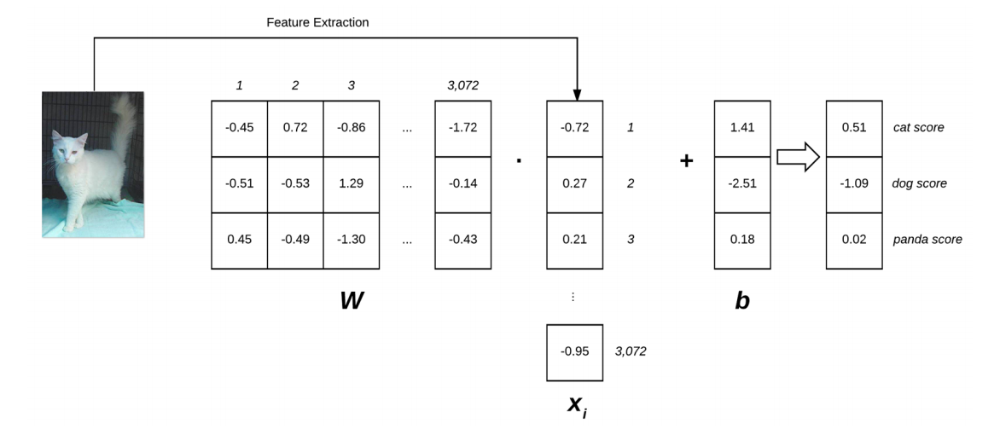

# <center> Welcome to Computer Vision</center>
 **<center>Trần Việt Anh - Hoàng Nguyên Phương</center>** 

## Chương 8 tham số Learning

Trong chương trước, chúng ta đã tìm hiểu về bộ phân loại k-NN - một mô hình học máy đơn giản đến mức nó không thực hiện bất kỳ “việc học” thực tế nào. Chúng tôi chỉ cần lưu trữ dữ liệu đào tạo bên trong mô hình và sau đó dự đoán được thực hiện tại thời điểm thử nghiệm bằng cách so sánh các điểm dữ liệu thử nghiệm với dữ liệu đào tạo của chúng tôi. Chúng ta đã thảo luận về nhiều ưu và nhược điểm của k-NN, nhưng trong bối cảnh tập dữ liệu quy mô lớn và học sâu, khía cạnh cấm nhất của k-NN là bản thân dữ liệu. Mặc dù việc đào tạo có thể đơn giản, nhưng việc kiểm tra diễn ra khá chậm, với điểm nghẽn là tính toán khoảng cách giữa các vectơ. Việc tính toán khoảng cách giữa các điểm đào tạo và kiểm tra sẽ chia tỷ lệ tuyến tính với số điểm trong tập dữ liệu của chúng tôi, làm cho phương pháp này trở nên không thực tế khi tập dữ liệu của chúng tôi trở nên khá lớn.

Trong chương trước, chúng ta đã tìm hiểu về bộ phân loại k-NN - một mô hình học máy đơn giản đến mức nó không thực hiện bất kỳ “việc học” thực tế nào. Chúng tôi chỉ cần lưu trữ dữ liệu đào tạo bên trong mô hình và sau đó dự đoán được thực hiện tại thời điểm thử nghiệm bằng cách so sánh các điểm dữ liệu thử nghiệm với dữ liệu đào tạo của chúng tôi. Chúng ta đã thảo luận về nhiều ưu và nhược điểm của k-NN, nhưng trong bối cảnh tập dữ liệu quy mô lớn và học sâu, khía cạnh cấm nhất của k-NN là bản thân dữ liệu. Mặc dù việc đào tạo có thể đơn giản, nhưng việc kiểm tra diễn ra khá chậm, với điểm nghẽn là tính toán khoảng cách giữa các vectơ. Việc tính toán khoảng cách giữa các điểm đào tạo và kiểm tra sẽ chia tỷ lệ tuyến tính với số điểm trong tập dữ liệu của chúng tôi, làm cho phương pháp này trở nên không thực tế khi tập dữ liệu của chúng tôi trở nên khá lớn. Tùy thuộc vào cách bạn nén và lưu trữ dữ liệu, mô hình này có thể đo bằng hàng trăm gigabyte đến terabyte trong chi phí lưu trữ và chi phí mạng. Điều này không chỉ gây lãng phí tài nguyên mà còn không tối ưu cho việc xây dựng mô hình học máy.

Thay vào đó, cách tiếp cận mong muốn hơn sẽ là xác định một mô hình học máy có thể học các mẫu từ dữ liệu đầu vào của chúng tôi trong thời gian đào tạo (yêu cầu chúng tôi dành nhiều thời gian hơn cho quá trình đào tạo), nhưng có lợi ích là được xác định bởi một số lượng nhỏ các tham số có thể dễ dàng được sử dụng để đại diện cho mô hình, bất kể kích thước đào tạo.

Trong chương này, chúng ta sẽ xem xét lại khái niệm tham số học và thảo luận về cách triển khai một bộ phân loại tuyến tính đơn giản. Như chúng ta sẽ thấy ở phần sau của cuốn sách này, học tham số là nền tảng của học máy hiện đại và các thuật toán học sâu

### 8.1 Hướng dẫn phân loại tuyến tính

Nửa đầu của chương này tập trung vào lý thuyết cơ bản và toán học xung quanh phân loại tuyến tính - và nói chung, các thuật toán phân loại tham số học tìm hiểu các mẫu từ dữ liệu đào tạo của chúng. Từ đó, tôi cung cấp ví dụ và triển khai phân loại tuyến tính thực tế bằng Python để chúng ta có thể thấy cách các loại thuật toán này hoạt động trong mã.

#### 8.1.1 Bốn thành phần của việc chọn tham số học

Tôi đã sử dụng từ “được tham số hóa” một vài lần, nhưng chính xác thì nó có nghĩa là gì? Nói một cách đơn giản: tham số hóa là quá trình xác định các tham số cần thiết của một mô hình nhất định. Trong nhiệm vụ của máy học, tham số hóa liên quan đến việc xác định một vấn đề theo bốn thành phần chính: dữ liệu, một hàm tính điểm, một hàm mất mát, trọng số và độ lệch. Chúng tôi sẽ xem xét từng điều này dưới đây.

**Dữ liệu**

Thành phần này là dữ liệu đầu vào của chúng ta mà chúng ta sẽ học từ đó. Dữ liệu này bao gồm cả các điểm dữ liệu (tức là cường độ pixel thô từ hình ảnh, các tính năng được trích xuất, v.v.) và các nhãn lớp liên quan của chúng. Thông thường, chúng tôi biểu thị dữ liệu của mình dưới dạng ma trận đa chiều
Mỗi hàng trong ma trận  đại diện cho một điểm dữ liệu trong khi mỗi cột (bản thân nó có thể là một mảng nhiều chiều) của ma trận tương ứng với một thuộc tính khác.

Ví dụ: hãy xem xét một tập dữ liệu gồm 100 hình ảnh trong không gian màu RGB, mỗi hình ảnh có kích thước 32 × 32 pixel. Ma trận thiết kế cho tập dữ liệu này sẽ là X ⊆ R 100 × (32 × 32 × 3) trong đó: Xi xác định hình ảnh thứ i trong R.Cùng với ma trận, chúng tôi cũng xác định một vectơ y trong đó yi cung cấp nhãn lớp thứ i trong tập dữ liệu.

**Tính hiệu suất**
cho điểm Chức năng cho điểm chấp nhận dữ liệu của chúng tôi làm đầu vào và ánh xạ dữ liệu vào các nhãn lớp. Ví dụ: với tập hợp các hình ảnh đầu vào của chúng tôi, hàm tính điểm sẽ lấy các điểm dữ liệu này, áp dụng một số hàm f (hàm tính điểm của chúng tôi), rồi trả về các nhãn lớp được dự đoán, tương tự như mã giả bên dưới

```python
INPUT_IMAGES => F(INPUT_IMAGES) => OUTPUT_CLASS_LABELS
```

**Độ mất mát**
Mục tiêu của chúng tôi khi đào tạo mô hình học máy là giảm thiểu hàm mất mát, do đó tăng độ chính xác phân loại của chúng tôi.

**Trọng số và độ lệch**
Ma trận trọng số, thường được ký hiệu là W và vectơ độ lệch b được gọi là trọng số hoặc tham số của bộ phân loại mà chúng tôi thực sự sẽ tối ưu hóa. Dựa trên kết quả đầu ra của hàm tính hiệu suất và hàm mất mát của chúng tôi, chúng tôi sẽ điều chỉnh và tìm hiểu các giá trị của trọng số và độ lệch để tăng độ chính xác của phân loại.

Tùy thuộc vào loại mô hình của bạn, có thể tồn tại nhiều tham số hơn, nhưng ở cấp độ cơ bản nhất, đây là bốn khối xây dựng của việc học tham số mà bạn sẽ thường gặp. Khi chúng tôi đã xác định bốn thành phần chính này, sau đó chúng tôi có thể áp dụng các phương pháp tối ưu hóa cho phép chúng tôi tìm thấy một tập hợp các tham số W và b giúp giảm thiểu hàm mất mát liên quan đến chức năng tính điểm của chúng tôi (đồng thời tăng độ chính xác phân loại trên dữ liệu của chúng tôi). Tiếp theo, hãy xem cách các thành phần này có thể làm việc cùng nhau để tạo bộ phân loại tuyến tính, chuyển đổi dữ liệu đầu vào thành các dự đoán thực tế.

### 8.1.2 Phân loại tuyến tính: Từ hình ảnh đến nhãn lớp

Trong phần này, chúng ta sẽ xem xét một thuật toán của cách tiếp cận mô hình tham số đối với học máy.
Để bắt đầu, chúng tôi cần dữ liệu của mình. Giả sử rằng tập dữ liệu đào tạo của chúng tôi được ký hiệu là xi trong đó mỗi hình ảnh có một nhãn lớp liên quan yi. Chúng ta sẽ giả sử rằng i = 1, ..., N và yi = 1, ..., K, ngụ ý rằng chúng ta có N điểm dữ liệu có chiều D, được phân tách thành K danh mục duy nhất. Để làm cho ý tưởng này cụ thể hơn, hãy xem xét tập dữ liệu “Động vật” của chúng tôi từ Chương 7. Trong tập dữ liệu này, chúng tôi có tổng số N = 3.000 hình ảnh. Mỗi hình ảnh có kích thước 32 × 32 pixel, được thể hiện trong không gian màu RGB (tức là ba kênh trên mỗi hình ảnh). Chúng ta có thể biểu diễn mỗi hình ảnh dưới dạng D = 32 × 32 × 3 = 3,072 giá trị riêng biệt. Cuối cùng, chúng ta biết có tổng số K = 3 nhãn lớp: một cho các lớp chó, mèo và gấu trúc, tương ứng.
Với các biến này, bây giờ chúng ta phải xác định một hàm tính điểm f ánh xạ các hình ảnh với điểm nhãn lớp. Một phương pháp để đạt được điểm này là thông qua ánh xạ tuyến tính đơn giản:

$$ f\left(x_{i}, W, b\right)=W x_{i}+b $$

Giả sử rằng mỗi xi được biểu diễn dưới dạng một vectơ cột duy nhất có hình dạng [D × 1] (trong ví dụ này, chúng tôi sẽ làm phẳng hình ảnh 32 × 32 × 3 thành một danh sách gồm 3.072 số nguyên). Ma trận trọng số W của chúng ta khi đó sẽ có hình dạng [K × D] (số lượng nhãn lớp theo kích thước của hình ảnh đầu vào).
Cuối cùng b, vectơ độ lệch sẽ có kích thước [K × 1]. Vectơ độ lệch cho phép chúng ta thay đổi và dịch hàm tính điểm của mình theo hướng này hay hướng khác mà không thực sự ảnh hưởng đến ma trận trọng số W. Tham số độ lệch thường rất quan trọng để học tập thành công. Quay trở lại với ví dụ về tập dữ liệu Động vật, mỗi xi được biểu diễn bằng một danh sách các giá trị điểm ảnh 3.072, do đó xi có hình dạng [3.072 × 1]. Hình 8.1 minh họa hàm cho điểm phân loại tuyến tính f. Ở bên trái, chúng ta có hình ảnh đầu vào ban đầu, được biểu diễn dưới dạng hình ảnh 32 × 32 × 3. Sau đó, chúng tôi làm phẳng hình ảnh này thành một danh sách các cường độ điểm ảnh 3.072 bằng cách lấy mảng 3D và định hình lại nó thành danh sách 1D.
<center></center>
<center><font size="-1">Hình 8.1:Minh họa tích số chập của ma trận trọng số W và vectơ đặc trưng x, tiếp theo là phép cộng số hạng độ lệch.</font></center>

Ma trận trọng số W của chúng tôi chứa ba hàng (một cho mỗi nhãn lớp) và 3.072 cột (một cho mỗi pixel trong hình ảnh). Sau khi lấy tích số chấm giữa W và xi, chúng tôi thêm vào vectơ độ lệch b - kết quả là hàm tính điểm thực tế của chúng tôi. Chức năng tính điểm của chúng tôi mang lại ba giá trị ở bên phải: điểm số được liên kết với các nhãn chó, mèo và gấu trúc, tương ứng

Nhìn vào hình và phương trình trên, bạn có thể định nghĩa rằng đầu vào xi và yi là cố định và không phải thứ chúng ta có thể sửa đổi. Nhưng chúng ta có thể thu được các xi yi khác nhau bằng cách áp dụng các phép biến đổi khác nhau cho hình ảnh đầu vào - nhưng khi chúng ta chuyển hình ảnh vào hàm tính điểm, các giá trị này không thay đổi. Trên thực tế, các tham số duy nhất mà chúng ta có quyền kiểm soát (về mặt tham số học) là ma trận trọng số W và vectơ độ lệch b của chúng ta. Do đó, mục tiêu của chúng tôi là sử dụng cả chức năng tính độ chính xác và độ mất mát để tối ưu hóa (nghĩa là sửa đổi một cách có hệ thống) vectơ trọng số và độ lệch để độ chính xác phân loại của chúng tôi tăng lên. Chính xác cách chúng tôi tối ưu hóa ma trận trọng lượng phụ thuộc vào hàm mất mát của chúng tôi, nhưng thường liên quan đến một số dạng gradient descent. Chúng ta sẽ xem xét các hàm mất mát ở phần sau của chương này.
Các phương pháp tối ưu hóa như gradient descent(và các biến thể của nó) sẽ được thảo luận trong Chương 9. Tuy nhiên, hiện tại, hãy hiểu một cách đơn giản rằng với một hàm tính điểm, chúng ta cũng sẽ xác định một hàm mất mát cho chúng ta biết dự đoán của chúng ta “tốt” như thế nào trên dữ liệu đầu vào.

### 8.1.3 Ưu điểm của việc học được tham số hóa và phân loại tuyến tính

Có hai lợi thế chính khi sử dụng phương pháp học tham số:

1. Khi chúng ta đã hoàn tất việc huấn luyện mô hình của mình, chúng ta có thể loại bỏ dữ liệu đầu vào và chỉ giữ lại ma trận trọng số W và vectơ độ lệch b. Điều này làm giảm đáng kể kích thước của mô hình của chúng tôi vì chúng tôi cần lưu trữ hai tập vectơ (so với toàn bộ tập huấn luyện)
2. Phân loại dữ liệu thử nghiệm mới nhanh chóng. 

### 8.1.4 Phân loại tuyến tuyến cơ bản với Python

Bây giờ chúng ta đã xem xét khái niệm về học tham số hóa và phân loại tuyến tính, hãy triển khai một bộ phân loại tuyến tính rất đơn giản bằng Python. Mục đích của ví dụ này không phải để chứng minh cách chúng tôi đào tạo một mô hình từ đầu đến cuối (chúng tôi sẽ trình bày điều đó trong chương sau vì chúng tôi vẫn còn một số cơ sở để trình bày trước khi chúng tôi sẵn sàng đào tạo một mô hình từ đầu), nhưng để chỉ ra cách đơn giản, chúng ta sẽ khởi tạo ma trận trọng số W, vectơ độ lệch b, và sau đó sử dụng các tham số này để phân loại một hình ảnh thông qua một sản phẩm chấm đơn giản. Hãy tiếp tục và bắt đầu ví dụ này. Mục tiêu của chúng tôi ở đây là viết một tập lệnh Python để phân loại chính xác Hình 8.2 là “con chó”.
<center></center>
<center><font size="-1">Hình 8.2:Hình chó trong bộ dữ liệu.</font></center>

Để xem cách chúng tôi có thể thực hiện phân loại này, hãy mở một tệp mới, đặt tên là linear_example.py

```python {.line-numbers}

import numpy as np
import cv2

labels = ["dog", "cat", "panda"]
np.random.seed(1)
```

Dòng 1 và 2 nhập các gói Python yêu cầu của chúng tôi. Chúng tôi sẽ sử dụng NumPy để xử lý số và OpenCV để tải hình ảnh mẫu của chúng tôi từ máy.
Dòng 4 khởi tạo danh sách các nhãn lớp mục tiêu cho tập dữ liệu “Động vật”.
Dòng 5 đặt trình tạo số ngẫu nhiên cho NumPy, đảm bảo rằng chúng tôi có thể tái tạo kết quả của thử nghiệm này. Tiếp theo, hãy khởi tạo ma trận trọng lượng và vectơ độ lệch của chúng tôi:

```python {.line-numbers}
W = np.random.randn(3, 3072)
b = np.random.randn(3)
```

Dòng 1 khởi tạo ma trận trọng số W với các giá trị ngẫu nhiên từ phân bố đồng đều, được lấy mẫu trên phạm vi [0,1]. Ma trận trọng số này có 3 hàng (một cho mỗi nhãn lớp) và 3072 cột (một cho mỗi pixel trong hình ảnh 32 × 32 × 3 của chúng tôi)
Sau đó, chúng tôi khởi tạo vectơ độ lệch trên Dòng 2. vectơ này cũng được điền ngẫu nhiên với các giá trị được lấy mẫu đồng nhất trên phân phối [0,1].Vectơ độ lệch của chúng ta có 3 hàng (tương ứng với số nhãn lớp) cùng với một cột.

Nếu chúng tôi đào tạo bộ phân loại tuyến tính này từ đầu, chúng tôi sẽ cần tìm hiểu các giá trị của W và b thông qua một quá trình tối ưu hóa. Tuy nhiên, vì chúng tôi chưa đạt đến giai đoạn tối ưu hóa của việc đào tạo một mô hình, tôi đã khởi tạo trình tạo số ngẫu nhiên với giá trị 1 để đảm bảo các giá trị ngẫu nhiên cung cấp cho chúng tôi phân loại "chính xác" (Tôi đã thử nghiệm các giá trị khởi tạo ngẫu nhiên trước để xác định giá trị cho chúng ta sự phân loại chính xác). Hiện tại, chỉ cần coi ma trận trọng số W và vectơ độ lệch b là 1 mảng được tối ưu một cách kì diệu (kiến thức kì dị đã được tiếp thu). Bây giờ ma trận trọng số và vectơ độ lệch của chúng ta đã được khởi tạo, hãy tải hình ảnh mẫu của chúng ta từ máy:

```python {.line-numbers}
orig = cv2.imread("Chuong8\dog.jpg")
image = cv2.resize(orig, (32, 32)).flatten()
```

Dòng 1 tải ảnh từ thư mục và đọc ảnh. Sau đó dòng 2 chuyển đổi kích thước dưới dạng mảng NumPy (32,32,3). Sau đó làm thẳng thành 1 vector có 3072 chiều.
Kế tiếp là tính toán hàm chính xác: 

```python
scores = W.dot(image) + b
```

chính là hàm tính điểm - nó chỉ đơn giản là tích số chấm giữa ma trận trọng số W và cường độ pixel hình ảnh đầu vào, tiếp theo là thêm vào độ chệch b. Cuối cùng, chúng tôi xử lý việc ghi các giá trị hàm tính điểm cho từng nhãn lớp vào thiết bị đầu cuối của chúng tôi, sau đó hiển thị kết quả ra màn hình của chúng tôi:

```python {.line-numbers}
for (label, score) in zip(labels, scores):
    print("[INFO] {}: {:.2f}".format(label, score))
cv2.putText(orig, "Label: {}".format(labels[np.argmax(scores)]),(10, 30),cv2.FONT_HERSHEY_SIMPLEX, 0.9, (0, 255, 0), 2)

cv2.imshow("Image", orig)
cv2.waitKey(0)

```
Chạy chương trình chúng tôi thấy được theo hình: 

```python
[INFO] dog: 11722.76
[INFO] cat: 2714.29
[INFO] panda: 24.31
```

Lưu ý cách lớp dog có giá trị hàm tính điểm lớn nhất, điều này ngụ ý rằng lớp "dog" sẽ được bộ phân loại của chúng tôi chọn làm dự đoán. Trên thực tế, chúng ta có thể thấy text dog được vẽ chính xác trên hình ảnh đầu vào của chúng ta (Hình 8.2) trong Hình 8.3.
<center></center>
<center><font size="-1">Hình 8.3:Hình chó trong bộ dữ liệu.</font></center>

Một lần nữa, hãy nhớ rằng đây là một ví dụ hiệu quả. Tôi cố ý đặt trạng thái ngẫu nhiên của tập lệnh Python của chúng tôi để tạo ra các giá trị W và b sẽ dẫn đến phân loại chính xác (bạn có thể thay đổi giá trị ngẫu nhiên trên.Trong thực tế, bạn sẽ không bao giờ khởi tạo các giá trị W và b của mình và cho rằng chúng sẽ cung cấp cho bạn phân loại chính xác mà không cần một số quá trình học tập. Thay vào đó, khi đào tạo các mô hình học máy của riêng chúng tôi từ đầu, chúng tôi sẽ cần tối ưu hóa và học W và b thông qua một thuật toán tối ưu hóa, chẳng hạn như gradient descent. Chúng tôi sẽ đề cập đến tối ưu hóa và  gradient descent trong chương tiếp theo. Do đó, toàn bộ mô hình của chúng tôi có thể được xác định thông qua hai giá trị: ma trận trọng số và véc tơ độ lệch. Biểu diễn này không chỉ nhỏ gọn mà còn khá mạnh mẽ khi chúng ta đào tạo mô hình máy học từ đầu.

### 8.2 Nguyên tắc hàm mất mát

Phần còn lại của chương này là dành riêng cho các hàm mất phổ biến. sẽ gặp phải khi xây dựng mạng nơ-ron và mạng học sâu

### 8.2.1 Hàm mất mát là gì

<center></center>
<center><font size="-1">Hình 8.4:Mất mát trong các epoch.</font></center>
Để cải thiện độ chính xác phân loại của chúng tôi, chúng tôi cần điều chỉnh các tham số của ma trận trọng số W hoặc vectơ độ lệch b. Chính xác cách chúng tôi cập nhật các thông số này là một vấn đề tối ưu hóa mà chúng tôi sẽ đề cập trong chương tiếp theo. Hiện tại, hãy hiểu một cách đơn giản rằng một hàm tổn thất có thể được sử dụng để định lượng chức năng tính điểm của chúng ta đang hoạt động tốt như thế nào trong việc phân loại các điểm dữ liệu đầu vào. Tốt nhất, tổn thất của chúng tôi sẽ giảm dần theo thời gian khi chúng tôi điều chỉnh các thông số mô hình của mình.
Như Hình 8.4 minh họa, tổn thất của Mô hình số 1 bắt đầu cao hơn Mô hình số 2 một chút, nhưng sau đó giảm nhanh chóng và tiếp tục ở mức thấp khi được đào tạo trên tập dữ liệu CIFAR-10. Ngược lại, tổn thất đối với Mô hình số 2 giảm ban đầu nhưng nhanh chóng trì trệ. Trong ví dụ cụ thể này, Mô hình số 1 đang đạt được mức tổn thất tổng thể thấp hơn và có thể là mô hình mong muốn hơn được sử dụng để phân loại các hình ảnh khác từ tập dữ liệu CIFAR-10. Tôi nói "có khả năng" bởi vì có khả năng là Mô hình số 1 quá phù hợp với dữ liệu đào tạo. Chúng tôi sẽ đề cập đến khái niệm overfitting này và cách phát hiện nó trong Chương 17.

### 8.2.2 Multi-class SVM Loss

Mất mát SVM nhiều lớp (như tên cho thấy) được lấy cảm hứng từ (Tuyến tính) Máy hỗ trợ (SVM) sử dụng chức năng tính điểm f để ánh xạ điểm dữ liệu của chúng tôi thành điểm số cho từng nhãn lớp. Hàm f này là một ánh xạ học đơn giản:

$$
f\left(x_{i}, W, b\right)=W x_{i}+b
$$

Bây giờ chúng ta đã có hàm tính độ chính xác, chúng ta cần xác định hàm này “tốt” hay “xấu” như thế nào (với ma trận trọng số W và vectơ thiên vị b) khi đưa ra dự đoán. Để xác định điều này, chúng ta cần một hàm mất mát. Nhớ lại rằng khi tạo một mô hình học máy, chúng ta có một ma trận thiết kế X, trong đó mỗi hàng trong X chứa một điểm dữ liệu mà chúng ta muốn phân loại.
Trong bối cảnh phân loại hình ảnh, mỗi hàng trong X là một hình ảnh và chúng tôi tìm cách gắn nhãn chính xác cho hình ảnh này. Chúng ta có thể truy cập hình ảnh thứ i bên trong X thông qua cú pháp xi. Tương tự, chúng ta cũng có một vectơ y chứa các nhãn lớp của chúng ta cho mỗi X. Các giá trị y này là nhãn  giá trị cơ bản của chúng ta và những gì chúng ta hy vọng hàm tính điểm của chúng ta sẽ dự đoán chính xác.Giống như chúng ta có thể truy cập một hình ảnh đã cho dưới dạng xi, chúng ta có thể truy cập nhãn lớp được liên kết thông qua yi. Để đơn giản hơn, hãy viết tắt hàm tính độ chính xác của chúng tôi là:
$$
s=f\left(x_{i}, W\right)
$$
Điều này ngụ ý rằng chúng ta có thể nhận được điểm dự đoán của lớp thứ j thông qua điểm dữ liệu thứ i:
$$
s_{j}=f\left(x_{i}, W\right)_{j}
$$
Sử dụng cú pháp này, chúng ta có thể kết hợp tất cả lại với nhau, thu được hàm mất căn bản:

$$
L_{i}=\sum_{j \neq y_{i}} \max \left(0, s_{j}-s_{y_{i}}+1\right)
$$
Về cơ bản, hàm mất bản lề là tính tổng trên tất cả các lớp không chính xác (i#j) và so sánh kết quả của hàm tính điểm s của chúng tôi được trả về cho nhãn lớp thứ j (lớp không chính xác) và lớp yi(lớp đúng ). Chúng tôi áp dụng phép toán tối đa để kẹp các giá trị bằng 0, điều này quan trọng để đảm bảo chúng tôi không tính tổng các giá trị âm.

Một xi đã cho được phân loại đúng khi tổn thất Li = 0. Để tính toán khoảng mất mát trên toàn bộ quá trình đào tạo của chúng tôi, chúng tôi chỉ cần lấy giá trị trung bình trên từng cá nhân Li.

$$
L=\frac{1}{N} \sum_{i=1}^{N} L_{i}
$$
Một chức năng mất liên quan khác mà bạn có thể gặp phải là hàm mất mát hinge bậc 2:
$$
L_{i}=\sum_{j \neq y_{i}} \max \left(0, s_{j}-s_{y_{i}}+1\right)^{2}
$$

Sử dụng bậc 2 có thể số lớn hơn trong việc dự đoán. Còn về việc bạn nên sử dụng hàm mất mát nào, điều đó hoàn toàn phụ thuộc vào tập dữ liệu của bạn.
**A Multi-class SVM Loss Example**

Bây giờ chúng ta đã xem xét toán học đằng sau việc tính toán hàm mất mát, hãy xem xét một ví dụ đã hoạt động. Chúng tôi sẽ lại sử dụng tập dữ liệu "Động vật" nhằm mục đích phân loại một hình ảnh nhất định là có chứa mèo, chó hoặc gấu trúc. Để bắt đầu, hãy xem Hình 8.5, nơi tôi đã đưa vào ba ví dụ đào tạo từ ba lớp của tập dữ liệu “Động vật”. Cho một số ma trận trọng số tùy ý W và vectơ độ lệch b, điểm đầu ra của f (x, W) = W x b được hiển thị trong phần thân của ma trận. Điểm số càng lớn, chức năng tính điểm của chúng tôi càng tin tưởng vào dự đoán.

 Hãy bắt đầu bằng cách tính toán thiệt hại Li cho lớp "chó":

```python
max(0, 1.33 - 4.26 + 1) + max(0, -1.01 - 4.26 + 1)
0
```

Tiếp theo hình mèo và panda ta có:
<center></center>
<center><font size="-1">Hình 8.5: So sánh chó,mèo, gấu trúc qua hàm mất mát.</font></center>

```python
#mèo
max(0, 3.76 - (-1.20) + 1) + max(0, -3.81 - (-1.20) + 1)
5.96
#gấu trúc
max(0, -2.37 - (-2.27) + 1) + max(0, 1.03 - (-2.27) + 1)
5.199999999999999

```

Trong trường hợp này, hàm mất mát của chúng tôi lớn hơn 0, cho thấy rằng dự đoán của chúng tôi là không chính xác. Nhìn vào chức năng tính độ chính xác của chúng tôi, chúng tôi thấy rằng mô hình của chúng tôi dự đoán chó là nhãn được đề xuất với điểm 3,76 (vì đây là nhãn có điểm cao nhất). Chúng tôi biết rằng nhãn này không chính xác - và trong Chương 9, chúng tôi sẽ tìm hiểu cách tự động điều chỉnh trọng số của mình để sửa những dự đoán này.

Chúng ta tính tổng mất mát được :
```python
(0.0 + 5.96 + 5.2) / 3.0
3.72
```
### 8.2.3 Mất mát entropy và phân loại softmax

Mặc dù việc mất mát hinge phổ biến, nhưng bạn có nhiều khả năng gặp phải tình trạng mất mátentropy chéo và bộ phân loại Softmax trong bối cảnh học sâu và mạng nơ-ron phức hợp. Tại sao thế này? Nói một cách đơn giản: Bộ phân loại Softmax cung cấp cho bạn xác suất cho từng nhãn lớp trong khi mất mát hinge  mang lại cho bạn lợi nhuận.

**Cross-entropy Loss**
Bộ phân loại Softmax là một tổng quát của dạng nhị phân của hồi quy logistic. Cũng giống như trước,hàm ánh xạ f của chúng ta được định nghĩa sao cho nó nhận một tập dữ liệu đầu vào là xi và ánh xạ chúng đến các nhãn lớp đầu ra thông qua tích số chấm của dữ liệu xi và ma trận trọng số W (bỏ qua độ lệch cho ngắn gọn):
$$
f\left(x_{i}, W\right)=W x_{i}=s_{i}
$$

Tuy nhiên hàm số tính độ mát mát khác,chúng ta có thể hiểu những điểm này là xác suất log không chuẩn hóa cho mỗi nhãn lớp. Chúng ta có hàm số mất mát cross entropy:
$$
L_{i}=-\log P\left(Y=y_{i} \mid X=x_{i}\right)
$$
Vì vậy, làm thế nào tôi đến đây? Chúng ta hãy phân tích các chức năng và xem xét.
 Để bắt đầu, hàm mất mát của chúng tôi phải giảm thiểu khả năng ghi giá trị âm của lớp chính xác:
$$
L_{i}=-\log \left(e^{s_{y_{i}}} / \sum_{j} e^{s_{j}}\right)
$$
Và khi đó công thức có thể được trình bày như sau: 
$$
P\left(Y=k \mid X=x_{i}\right)=e^{s_{y_{i}}} / \sum_{j} e^{s_{j}}
$$
Tính lũy thừa và chuẩn hóa thông qua tổng số mũ là hàm Softmax của chúng tôi,việc tính toán mất mát cross-entropy trên toàn bộ tập dữ liệu được thực hiện bằng cách lấy giá trị trung bình:
$$
L=\frac{1}{N} \sum_{i=1}^{N} L_{i}
$$
Chúng tôi sẽ quay trở lại chính quy hóa, giải thích nó là gì, cách sử dụng nó và tại sao nó lại quan trọng đối với mạng thần kinh và học sâu trong Chương 9. Nếu các phương trình ở trên có vẻ đáng sợ, đừng lo lắng - chúng tôi sắp sửa các ví dụ số trong phần tiếp theo để đảm bảo bạn hiểu cách hoạt động của mất mát cross-entropy.

Sau đây chúng tôi có ví dụ về đầu vào input gấu trúc và hàm tính hiệu suất điểm

<center></center>

<center><font size="-1">Hình 8.6 Hình ảnh gấu trúc </font></center>
Để chứng minh tổn thất entropy chéo trong hoạt động, hãy xem Hình 8.6. Mục tiêu của chúng tôi là phân loại xem hình ảnh trên có chứa chó, mèo hay gấu trúc hay không. Rõ ràng, chúng ta có thể thấy rằng hình ảnh là một con “gấu trúc” - nhưng bộ phân loại Softmax của chúng tôi nghĩ gì? Để tìm hiểu, chúng ta sẽ cần xem xét từng bảng trong 4 bảng sau.

|  | Scoring Function |
| :--- | ---: |
| Dog | -3.44 |
| Cat | 1.16 |
| Panda | 3.91 |
Bảng đầu tiên bao gồm đầu ra của hàm tính điểm f của chúng tôi cho từng lớp trong số ba lớp, tương ứng. Các giá trị này là xác suất nhật ký không chuẩn hóa của chúng tôi cho ba lớp. Sau đó:
|  | Scoring Function | Unnormalized Probabilities |
| :--- | ---: | ---: |
| Dog | -3.44 | 0.03 |
| Cat | 1.16 | 3.19 |
| Panda | 3.91 | 49.90 |
Hãy tính lũy thừa kết quả đầu ra của hàm tính điểm (e s, trong đó s là giá trị hàm điểm của chúng ta), tạo ra xác suất không chuẩn hóa của chúng ta (bảng thứ hai)
|  |  | Scoring Function | Unnormalized Probabilities | Normalized Probabilities |
| :--- | ---: | ---: | ---: | :---: |
| Dog | -3.44 | 0.0321 | 0.0006 |  |
| Cat | 1.16 | 3.1899 | 0.0601 |  |
| Panda | 3.91 | 49.8990 | 0.9393 |  |
Bước tiếp theo là lấy mẫu số, tính tổng các số mũ và chia cho tổng, do đó thu được các xác suất thực tế liên quan đến mỗi nhãn lớp (bảng thứ ba).
|  | Scoring Function | Unnormalized Probabilities | Normalized Probabilities | Negative Log Loss |
| :--- | ---: | ---: | ---: | ---: |
| Dog | -3.44 | 0.0321 | 0.0006 | 7.4126 |
| Cat | 1.16 | 3.1899 | 0.0601 | 2.8126 |
| Panda | 3.91 | 49.8990 | 0.9393 | 0.0626 |
Cuối cùng, chúng ta có thể lấy logarit tự nhiên âm, −ln (p), trong đó p là xác suất chuẩn hóa, mang lại mất mát cuối cùng của chúng ta (bảng thứ tư và bảng cuối cùng).

Trong trường hợp này, bộ phân loại Softmax của chúng tôi sẽ báo cáo chính xác hình ảnh là gấu trúc với 93,93%.Sau đó, chúng tôi có thể lặp lại quy trình này cho tất cả các hình ảnh trong tập huấn luyện của mình, lấy giá trị trung bình và thu được tổn thất tổng thể qua entropy cho tập huấn luyện. Quá trình này cho phép chúng tôi định lượng tốt hay xấu một bộ thông số đang hoạt động trên bộ đào tạo của chúng tôi.

### 8.3 Tổng kết 

Trong chương này, chúng ta đã xem xét bốn thành phần của tham số học: 1. Dữ liệu 2. Chức năng cho điểm 3. Chức năng giảm 4. Trọng số và độ lệch Trong bối cảnh phân loại hình ảnh, dữ liệu đầu vào của chúng ta là tập dữ liệu về hình ảnh. Chức năng cho điểm tạo ra các dự đoán cho một hình ảnh đầu vào nhất định. Sau đó, hàm mất mát xác định mức độ tốt hay xấu của một tập hợp các dự đoán trên tập dữ liệu. Cuối cùng, ma trận trọng số và vectơ độ lệch là những gì cho phép chúng ta thực sự “học” từ dữ liệu đầu vào - các thông số này sẽ được tinh chỉnh và điều chỉnh thông qua các phương pháp tối ưu hóa nhằm cố gắng đạt được độ chính xác phân loại cao hơn. Sau đó, chúng tôi xem xét hai hàm mất mát phổ biến: mất mát hingle và mất entropy chéo.

Trong chương tiếp theo, chúng tôi sẽ xem xét các phương pháp tối ưu hóa được sử dụng để điều chỉnh ma trận trọng số và vectơ chệch hướng của chúng tôi. Các phương pháp tối ưu hóa cho phép các thuật toán của chúng tôi thực sự học hỏi từ dữ liệu đầu vào của chúng tôi bằng cách cập nhật ma trận trọng số và vectơ độ lệch dựa trên kết quả đầu ra của các hàm tính điểm và giảm của chúng tôi. Sử dụng các kỹ thuật này, chúng ta có thể thực hiện các bước gia tăng đối với các giá trị tham số có được mức suy hao thấp hơn và độ chính xác cao hơn. Các phương pháp tối ưu hóa là nền tảng của mạng nơ-ron hiện đại và học sâu, và nếu không có chúng, chúng ta sẽ không thể học các mẫu từ dữ liệu đầu vào của mình, vì vậy hãy nhớ chú ý đến chương sắp tới.
[Xem tiếp chương 3](Chuong9/chuong9.md)